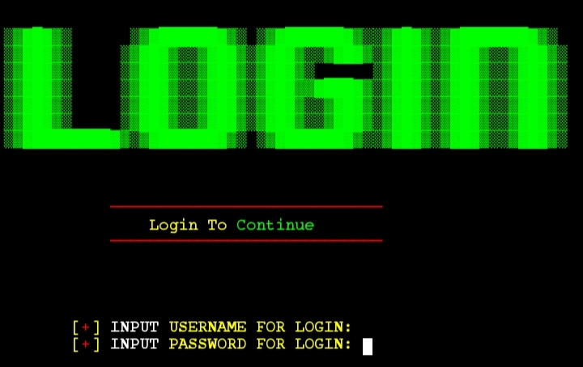
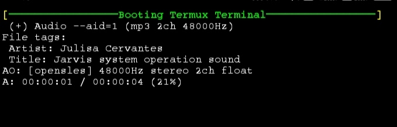
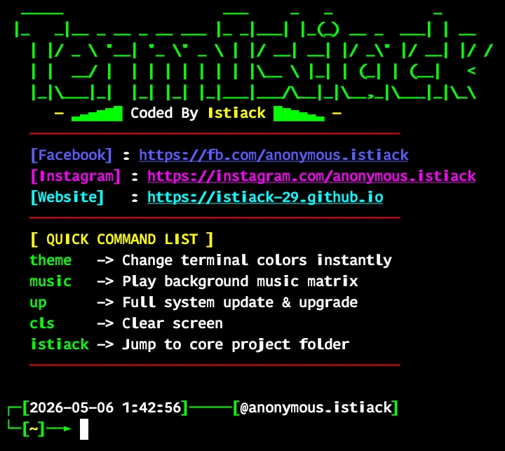

# ⚡ TERMISTIACK ⚡

## 🚀 The Ultimate Terminal Masterpiece
**TermIstiack** is no longer just a theme—it is a **Full Terminal OS Experience**. Rebuilt from the ground up with a Zsh-based engine, it brings elite features like AI-powered auto-suggestions, background music looping, and a live theme engine to your Android or Linux environment.

**Repository Views** 

---

## 💎 Exclusive Ultra-Premium Features
* 🛡️ **Intruder Alert System**: 3-attempts login security. Fail 3 times, and the terminal locks into a Matrix execution screen.
* 🧠 **AI Auto-Suggestions**: Predicts your next command based on history. Just tap **Right Arrow** to complete.
* 🌈 **Live Syntax Highlighting**: Visual feedback while typing—Valid commands turn **Green**, invalid ones turn **Red**.
* 🎨 **Dynamic Theme Engine**: Type `theme` to swap between Matrix Green, Ocean Blue, Hacker Red, or Cyberpunk Purple instantly.
* 🎧 **Hidden Audio Matrix**: Type `music` to trigger a background loop player. Plays your m1.mp3, m2.mp3 etc. from a hidden `.music` folder.
* 🔊 **Jarvis OS Sounds**: High-quality audio feedback upon successful system access.
* ⚡ **Turbo Aliases**: Built-in shortcuts like `up` (update), `cls` (clear), and `istiack` (jump to home).

---

## 📸 Interface Preview

| 🔐 Login Screen | 🚀 Booting Process | 💻 Main Terminal |
| :---: | :---: | :---: |
|  |  |  |
| *Login Interface* | *Premium Animation* | *Zsh Custom Prompt* |

---

## ⚡ INSTANT INSTALLATION (Copy & Paste)

### 📱 For Termux
```bash
apt update && apt upgrade -y && pkg install git -y && git clone https://github.com/istiack-29/TermIstiack && cd TermIstiack && chmod +x * && bash setup.sh

```
### 🐧 For Linux (Debian/Ubuntu/Kali)
```bash
sudo apt update && sudo apt upgrade -y && sudo apt install git zsh mpv cmatrix pv figlet -y && git clone https://github.com/istiack-29/TermIstiack && cd TermIstiack && chmod +x * && bash setup.sh

```
## 🛠️ Terminal Commands Manual
| Command | Action |
|---|---|
| theme | Open the Live Theme Manager (Change colors instantly) |
| music | Open the Audio Matrix (Play/Stop background loops) |
| up | One-tap system update and upgrade |
| cls | Ultra-fast screen clear |
| istiack | Instantly jump to the project core directory |
> **Pro Tip**: To use the music player, move your mp3 files to ~/TermIstiack/.music/ and rename them to **m1.mp3**, **m2.mp3** and so on.
> 
## 📜 Copyright & License
This masterpiece is authored by **Istiack**.
 1. Keep the original credits if you fork or modify the code.
 2. Intended for personal and educational use.
 3. The author is not responsible for any misuse of the tool.
**Coded With ❤️ By Istiack [istiack-29]**
```